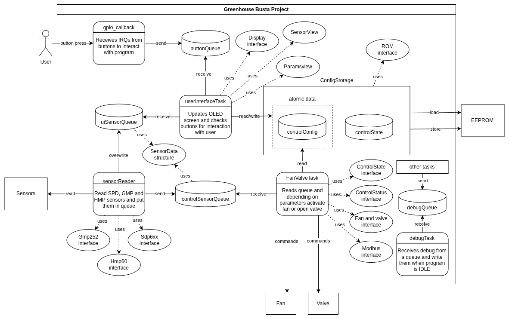

# Greenhouse Burta Project

## Description

This project was made as an assignment at Metropolia UAS, Finland. It's a **CO2 level controller for a greenhouse**.
It's programmed using a `Raspberry Pico`, a `GMP252`, a `HMP60` and a `SDP510` sensor, an `OLED` screen, a fan and a
valve controller.

The goal is to keep the CO2 levels at a targeted level, chosen by the user. When the CO2 levels go over 2000ppm, it will
be brought down to the targeted level through ventilation. When the level is lower than the targeted level, it will be
brought up to the targeted level through opening the valve for 1 second every 30 seconds until the level is reached.

You can find more information inside the [CO2 controller specification](doc/Greenhouse%20CO2_controller_specification.pdf).

## Project Structure

```text
greenhouse-busta/
├── doc/                  # Documentation, datasheets and diagrams
│   ├── diags/            # Architecture and system diagrams
│   └── images/           # Diagrams converted to images
├── pico-sdk/             # Raspberry Pi Pico SDK
├── rp2040-freertos/      # FreeRTOS kernel and dependencies
├── src/                  # Application source code
│   ├── actuators/        # Fan and CO2 valve interface
│   ├── buttons/          # Physical button handling
│   ├── control/          # Fan and CO2 valve control task
│   ├── debug/            # Debugging utilities
│   ├── drivers/          # Hardware communication (UART, I2C, Modbus)
│   ├── sensors/          # Sensor interfaces and measurements
│   ├── shared/           # Shared data structures and configuration
│   ├── ui/               # Display views and user interface task
│   ├── CMakeLists.txt    # Application build configuration
│   ├── FreeRTOSConfig.h  # FreeRTOS configuration
│   └── main.cpp          # Application entry point and initialization
├── CMakeLists.txt        # Main CMake build configuration
├── openocd.cfg           # OpenOCD debugging configuration
└── README.md             # Project documentation
```

## How to flash the program

### 1. Prerequisites

Make sure the following tools are installed:

- **CMake** and **Ninja** (or Make) for compilation.
- **ARM GNU Toolchain** (`arm-none-eabi-gcc`) for cross-compilation.
- **OpenOCD** for flashing and debugging.
- **CMSIS-DAP debugger** connected to the Raspberry Pi Pico.

Clone the repository with its submodules:

```bash
git clone --recurse-submodules <repository-url>
cd greenhouse-busta
```

### 2. Compile the project

From the project root, configure and compile the firmware:

```bash
cmake -S . -B build -G Ninja -DCMAKE_BUILD_TYPE=Debug
cmake --build build
```

The compiled firmware is generated in `build/src/`, typically as:

- `greenhouse-busta.elf` — Firmware for flashing and debugging.
- `greenhouse-busta.uf2` — Firmware for flashing via USB.

### 3. Flash the Raspberry Pi Pico

**Option A — OpenOCD (CMSIS-DAP debugger)**

Connect the debugger to the Pico's SWD interface and execute:

```bash
openocd -f openocd.cfg \
  -c "program build/src/greenhouse-busta.elf verify reset exit"
```

**Option B — USB (BOOTSEL mode)**

1. Hold the **BOOTSEL** button while connecting the Pico to your computer via USB.
2. The Pico should appear as a USB mass-storage device named `RPI-RP2`.
3. Copy `greenhouse-busta.uf2` to the device.
4. The Pico will automatically reboot and execute the firmware.

### 4. Debugging (optional)

The project can be debugged using **CLion**, **OpenOCD**, and **GDB** with the provided `openocd.cfg` configuration.

## User Manual

The greenhouse controller features an OLED display and three physical buttons (SW0, SW1, SW2) for navigating between 
views and adjusting the CO2 regulation settings.

### Display Views

**1. Sensors View**

The default screen displays the current greenhouse measurements:

- **CO2**: Current concentration in ppm.
- **Temperature**: Current temperature in °C.
- **Humidity**: Current relative humidity in %.
- **Pressure**: Differential pressure measured by the sensor.

The measurements are updated automatically during operation.

| Button | Function    |
|--------|-------------|
| SW0    | Switch view |

**2. Configuration View**

This screen allows the user to view and modify the target CO2 concentration.

| Button | Function            |
|--------|---------------------|
| SW0    | Switch view         |
| SW1    | Decrease target C02 |
| SW2    | Increase target C02 |

### Basic Operation

1. Power on the Raspberry Pico to start the greenhouse controller.
2. The **Sensors View** appears by default.
3. Press **SW0** to open the Configuration View.
4. Use **SW1** and **SW2** to adjust the desired CO2 concentration.
5. Press **SW0** again to return to the Sensors View.

The controller automatically regulates the fan and CO2 valve according to the configured parameters.

## Diagrams



## Roles

- **Pavel Shishkin**: Storing data (EEPROM) and ROM interface, Screen interface
- **Pere Joan Garriga Voltas**: Modbus communication, Fan and valve interface, Fan and valve control task
- **Fabien Léger**: SDP610, GMP and HMP sensors, Buttons, Screen task, Debug task

Dropped features:
- EEPROM loading at program start (config gets stored when it changes, but never loaded at start)
- WiFi (ThingSpeak)
- UART based console
- Watchdog